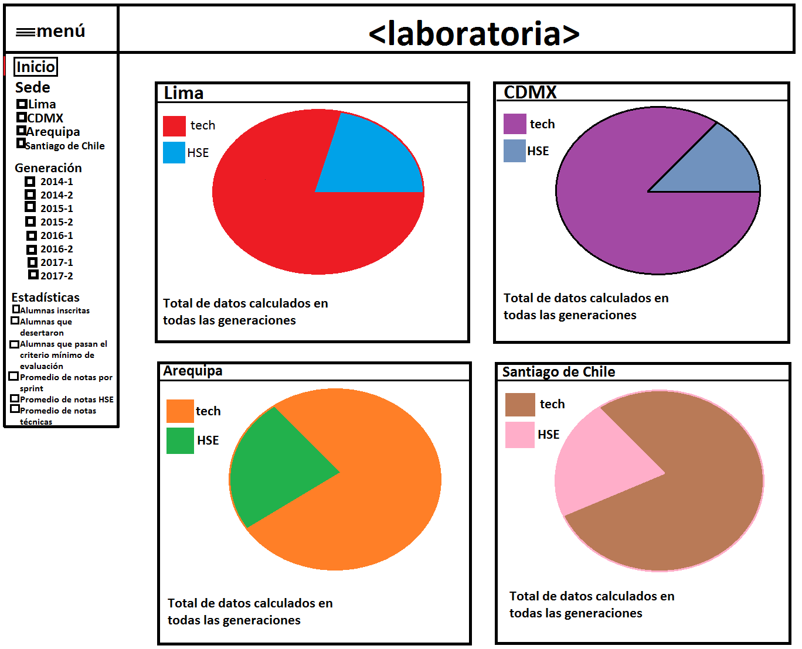
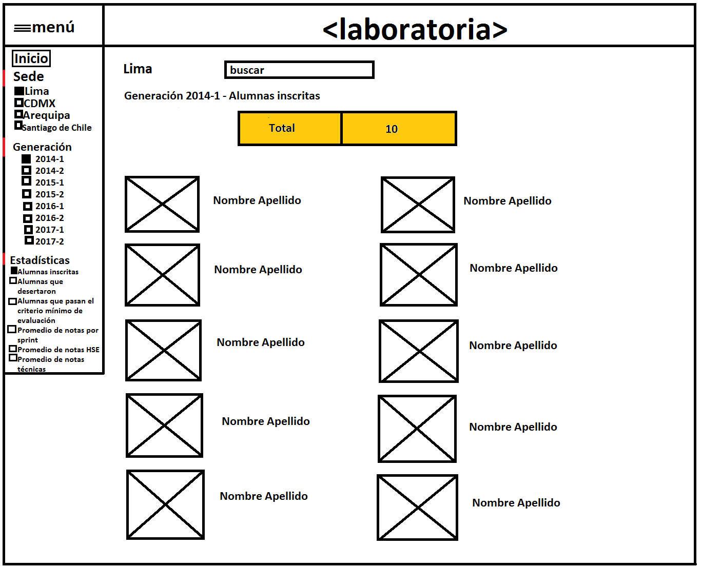
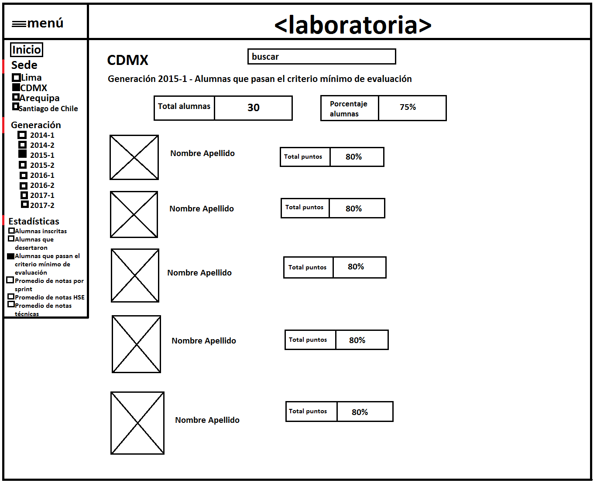
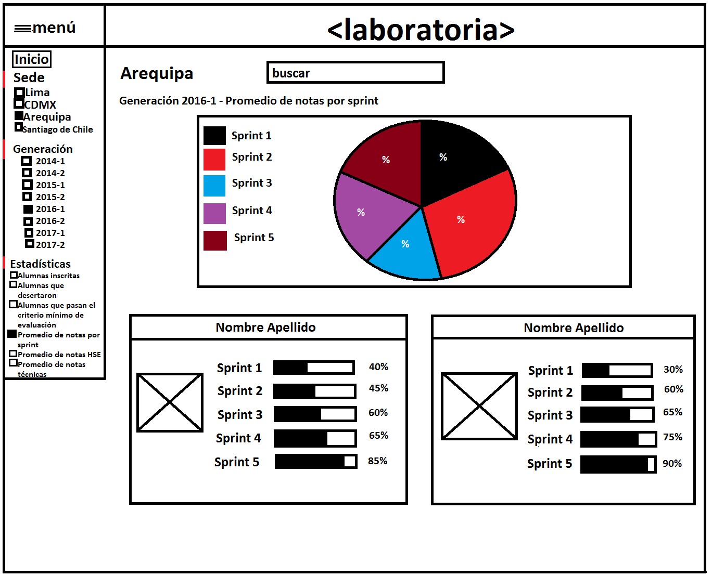
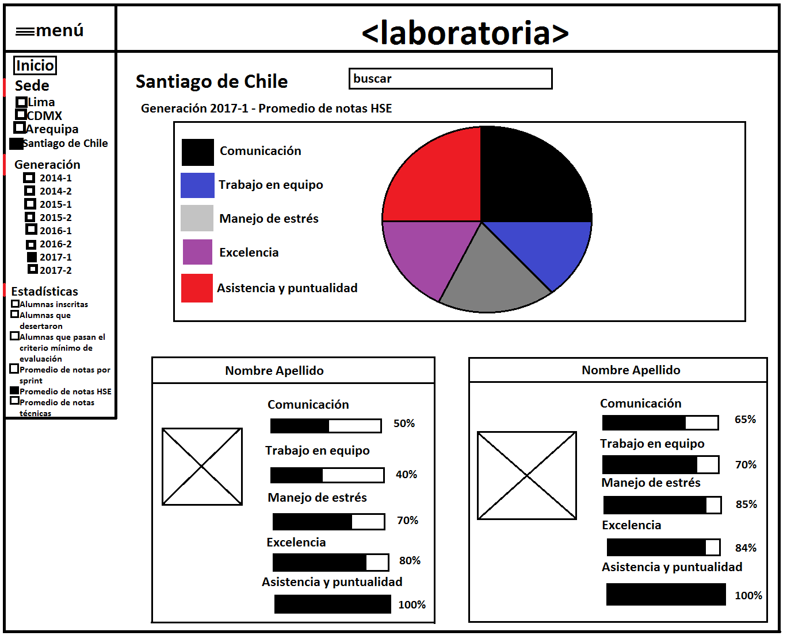
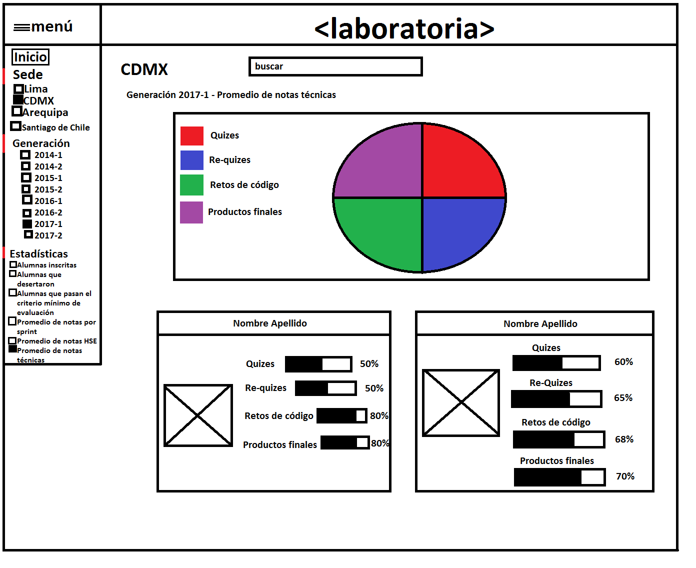
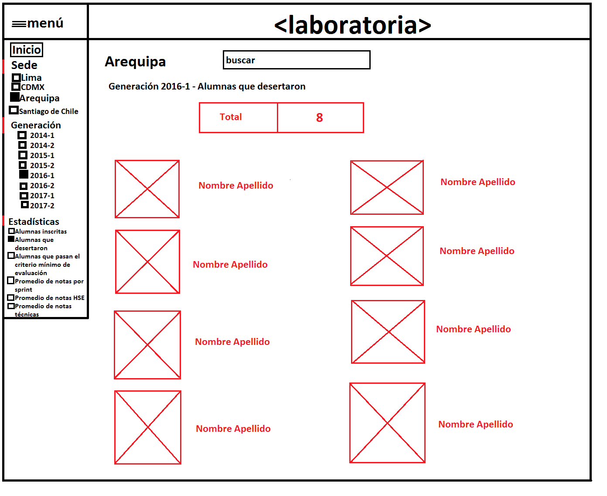
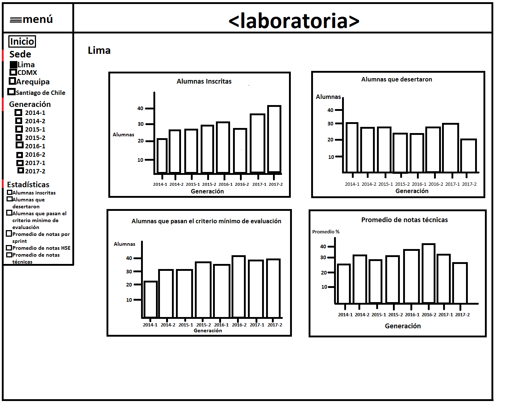

#Sketching Laboratoria

##Página principal

##Sede Lima - Generación 2014-1 - Alumnas inscritas

##Sede CDMX - Generación 2015-1 - Alumnas que pasan el criterio mínimo de evaluación

##Sede Arequipa - Generación 2016-1 - Promedio de notas por sprint

##Sede Santiago de Chile - Generación 2017-1 - Promedio de notas HSE

##Sede CDMX - Generación 2017-1 - Promedio de notas técnicas

##Sede Arequipa - Generación 2016-1 - Alumnas que desertaron

##Sede Lima - parte principal

