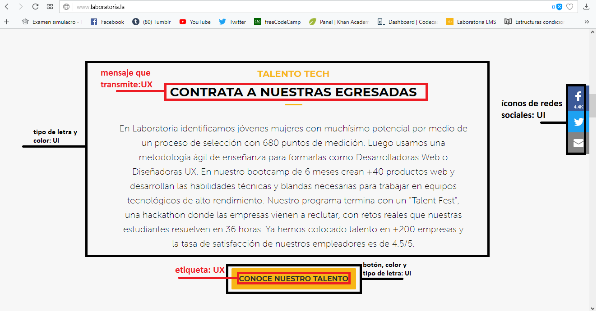

#LABORATORIA UX-UI:

##Las partes que conforman el UI son:
  * botones
  * el cambio del cursor que pasa sobre algún botón.
  * el tipo de letra.
  * las redes sociales
  * todos los elementos de navegación
  * el logotipo
  * enlaces
  * íconos de redes sociales

##Las partes que conforman el UX:
  * organización de la página
  * colores que se acomoden a la vista del usuario
  * etiquetado de los botones
  * el mensaje que transmiten las imágenes y el texto
  * la comodidad con la que el usuario puede navegar
  * el sentimiento que causa al estar dentro de la página

###Parte principal

###Segunda parte - Postula

###Tercera parte - Egresada de LABORATORIA

###Cuarta parte - Talento tech

###Quinta parte - Contrato tech

###Sexta parte - Corporate

###Séptima parte - Experiencia

###Octava parte - Impacto

###Novena parte - Obama

###Décima parte - Aliados

###Décima primera parte - Reconocimientos

###Décima segunda parte - Presencia en los medios

###Décima tercera parte - Blog

###Décima cuarta parte - Footer

